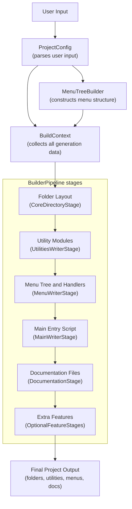
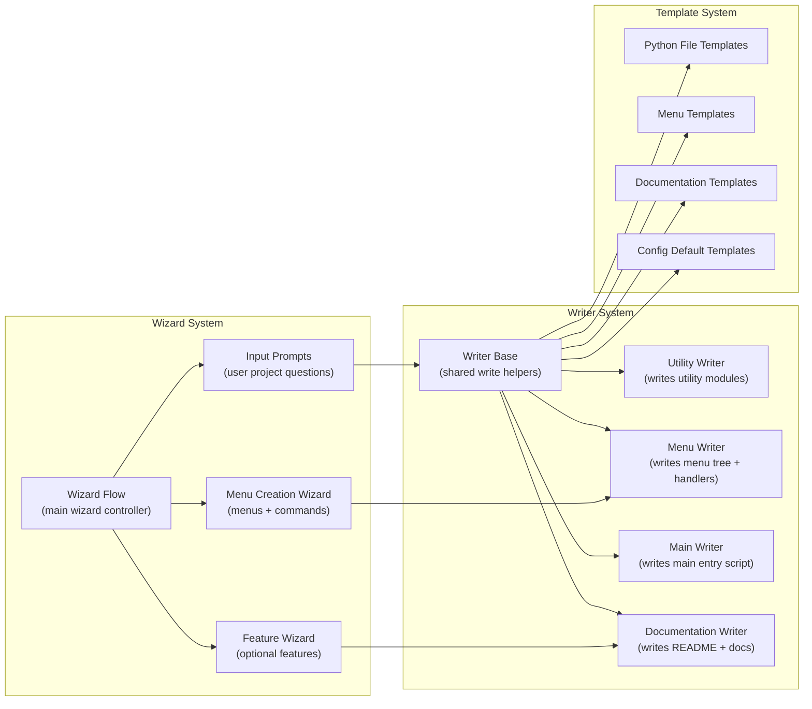
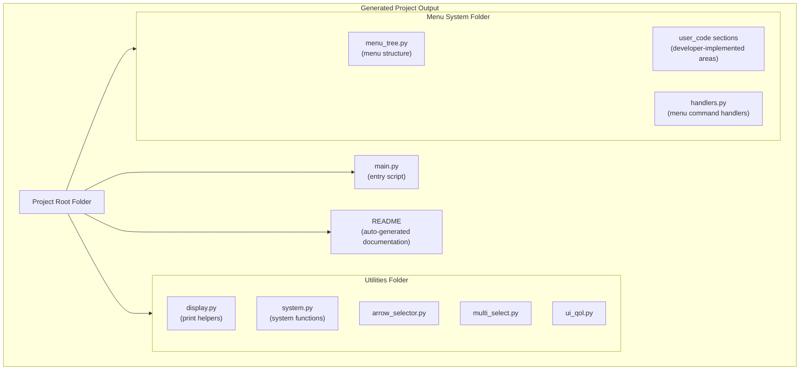

# CLI Generator – Architectural Overview

This document provides a complete architectural overview of the CLI Generator system, including high‑level structure, internal engine subsystems, the full project generation process, and the output architecture. All diagrams are written in Mermaid and will render when possible.

---

## 1. High‑Level Architecture Overview

```mermaid
flowchart LR

    UserInput["User Input"]
    Config["ProjectConfig<br>(parses project definition)"]
    TreeBuilder["MenuTreeBuilder<br>(builds menu hierarchy)"]
    BuildContext["BuildContext<br>(stores parsed state)"]

    UserInput --> Config
    Config --> TreeBuilder
    Config --> BuildContext
    TreeBuilder --> BuildContext

    Pipeline["BuilderPipeline<br>(executes generation stages)"]
    BuildContext --> Pipeline

    subgraph Engine[Internal Engine Subsystems]
        Writers["Writer System"]
        Templates["Template System"]
        Wizard["Wizard System"]
    end

    Pipeline --> Engine

    Output["Generated Project Output<br>(final folder + code tree)"]
    Engine --> Output
```

---

## 2. Full Project Generation Process

---

## 3. Internal Engine Subsystems (High Detail)

---

## 4. Output Architecture

